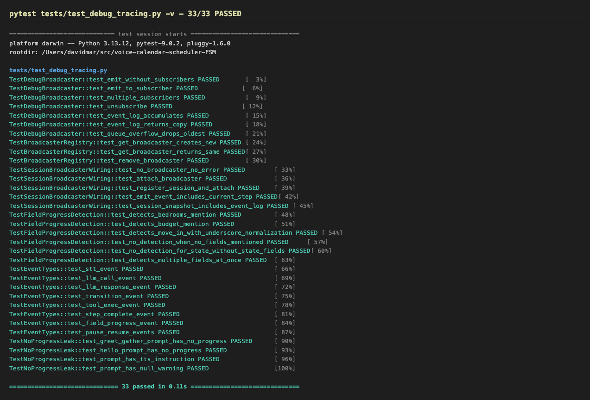
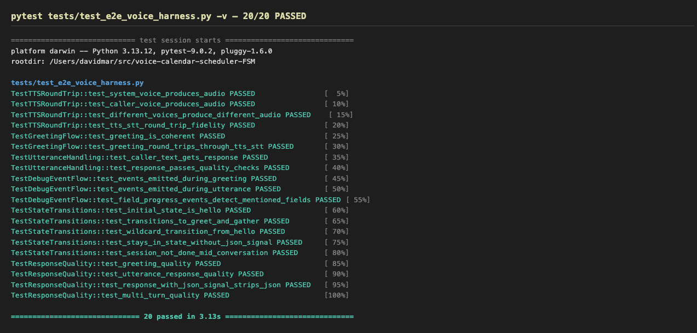

# Voice Calendar Scheduler FSM

A 24/7 voice-driven apartment viewing scheduling assistant. Callers dial a Twilio phone number or connect via browser WebRTC, describe what apartment they're looking for, and the system searches listings, checks Google Calendar availability, and books a viewing appointment — all through natural voice conversation guided by an 8-step Finite State Machine.

## Architecture

```
Caller (phone/browser)
    │
    ├── Twilio PSTN ──→ Media Streams WS ──→ TwilioMediaStreamChannel (mulaw 8kHz ↔ PCM 16kHz)
    │                                              │
    └── Browser WebRTC ──→ Signaling WS ──→ WebRTCChannel (Opus 48kHz ↔ PCM 16kHz)
                                                   │
                                              SchedulingSession
                                                   │
                                    ┌──────────────┼──────────────┐
                                    │              │              │
                                STT (whisper)   FSM (8 steps)  TTS (piper)
                                                   │
                                    ┌──────────────┼──────────────┐
                                    │              │              │
                              RAG search    Google Calendar   LLM (Claude/Ollama)
```

**Key components:**

- **Engine** (`engine-repo/`): Git submodule providing the FSM orchestrator, LLM abstraction, STT (faster-whisper), TTS (Piper), and tool framework
- **Scheduling** (`scheduling/`): Domain application — session management, voice channels, calendar integration, workflow FSM, and tools
- **Gateway** (`gateway/`): WebRTC signaling, TURN credential fetching, browser client support
- **RAG Service**: Apartment listings search via LanceDB + nomic-embed (runs in Docker)

## 8-Step Scheduling Workflow

| Step | Type | What Happens |
|------|------|-------------|
| 1. Greet & Gather | LLM | Extract preferences: bedrooms, budget, area, move-in date |
| 2. Search Listings | Tool | Query RAG service for matching apartments |
| 3. Present Options | LLM | Narrate top 2-3 matches to caller |
| 4. Check Availability | Tool | Query Google Calendar freeBusy API for open slots |
| 5. Propose Times | LLM | Present 2-3 available viewing slots |
| 6. Collect Details | LLM | Gather caller name, email, confirm slot |
| 7. Create Booking | Tool | Create Google Calendar event, send invite |
| 8. Confirm & Done | LLM | Confirm details, say goodbye |

## Setup

### Prerequisites

- Python 3.11+ (3.13 recommended)
- Git (for submodules)
- Docker (optional, for RAG service)

### Quick Start

```bash
# Clone with submodules
git clone --recursive <repo-url>
cd voice-calendar-scheduler-FSM

# Run setup (creates venv, installs deps, runs tests)
./scripts/setup.sh

# Edit .env with your API keys
$EDITOR .env

# Start the server
./scripts/run.sh
```

The setup script:
- Finds Python 3.11+ on your system
- Initializes the engine git submodule
- Creates a virtual environment in `.venv/`
- Installs all dependencies (core, LLM, integrations, voice)
- Creates `.env` from `.env.example`
- Runs verification and tests

Use `./scripts/setup.sh --quick` to skip heavy voice packages (faster-whisper, piper-tts, aiortc) for faster setup during development.

## Configuration

Copy `.env.example` to `.env` and fill in your credentials:

| Variable | Required | Description |
|----------|----------|-------------|
| `LLM_PROVIDER` | Yes | `claude` or `ollama` |
| `ANTHROPIC_API_KEY` | If claude | Claude API key |
| `OLLAMA_MODEL` | If ollama | Model name (e.g. `qwen2.5:7b`) |
| `TWILIO_ACCOUNT_SID` | For phone | Twilio account SID |
| `TWILIO_AUTH_TOKEN` | For phone | Twilio auth token |
| `TWILIO_PHONE_NUMBER` | For phone | Your Twilio number |
| `GOOGLE_SERVICE_ACCOUNT_JSON` | For booking | Path to service account JSON |
| `GOOGLE_CALENDAR_ID` | For booking | Calendar ID (default: `primary`) |
| `RAG_SERVICE_URL` | For search | RAG endpoint (default: `http://localhost:8000`) |
| `PORT` | No | Server port (default: `8080`) |
| `ICE_SERVERS_JSON` | No | Fallback ICE servers for WebRTC |

## Running

```bash
# Start the server (default port 8090)
./scripts/run.sh

# Or manually:
PYTHONPATH=".:engine-repo" .venv/bin/uvicorn scheduling.app:app --port 8090

# With custom port:
PORT=9000 ./scripts/run.sh
```

Once running:
- **Browser client**: http://localhost:8090
- **Admin panel**: http://localhost:8090/admin
- **Health check**: http://localhost:8090/health
- **Twilio webhook**: Configure your Twilio number to POST to `https://<your-host>/twilio/voice`

### RAG Service (Apartment Search)

The RAG service powers the apartment search tool. It runs as a Docker container with LanceDB + nomic-embed for semantic search. **Data persists across restarts** via a Docker volume — you only need to ingest once.

#### First-time setup

```bash
# 1. Start the RAG service (first boot takes ~30s to load the embedding model)
docker compose up -d rag

# 2. Wait for it to be healthy
curl -sf http://localhost:8000/health
# → {"status":"healthy","documents":0,...}

# 3. Ingest apartment listings (choose one)

# Option A: Sample data (10 hand-crafted Austin listings, instant)
PYTHONPATH=".:engine-repo" .venv/bin/python -m listings.ingest

# Option B: Kaggle data (535 real Austin TX listings, ~30s)
PYTHONPATH=".:engine-repo" .venv/bin/python -m listings.ingest --data listings/data/austin_apartments.json

# 4. Verify search works
curl -s -X POST http://localhost:8000/query \
  -H "Content-Type: application/json" \
  -d '{"query": "2 bedroom pet friendly", "top_k": 3}' | python3 -m json.tool
```

#### After a restart

Data persists in the Docker volume, so just start the container:

```bash
docker compose up -d rag
# Wait ~30s for model load, then it's ready with all previously ingested data
curl -sf http://localhost:8000/health
# → {"status":"healthy","documents":535,...}
```

You do **not** need to re-ingest. The only time you need to ingest again is if you:
- Remove the Docker volume (`docker volume rm voice-calendar-scheduler-fsm_rag-data`)
- Want to add new/different listings

#### Importing your own CSV data (optional)

To import from a different apartment CSV (e.g., a fresh Kaggle download):

```bash
# Download from https://www.kaggle.com/datasets/shashanks1202/apartment-rent-data

# Import and filter to Austin TX
PYTHONPATH=".:engine-repo" .venv/bin/python -m listings.import_csv \
    /path/to/apartments_for_rent_classified_100K.csv \
    --city Austin --state TX \
    --output listings/data/austin_apartments.json

# Then ingest into RAG
PYTHONPATH=".:engine-repo" .venv/bin/python -m listings.ingest --data listings/data/austin_apartments.json
```

The import pipeline auto-detects CSV delimiters (comma, semicolon, tab) and uses a configurable column mapping (`listings/data/column_mappings/kaggle_shashanks1202.json`). To use a different CSV format, create a new mapping file and pass `--mapping-file`.

## Admin Panel

The admin panel at `/admin` provides runtime controls:

- **Barge-in detection** — Toggle whether users can interrupt the bot mid-speech
- **Voice selection** — Switch between Kokoro and Piper TTS engines, pick from ~40 Kokoro voices across 6 languages
- **Live config** — View current runtime settings as JSON

To use Kokoro voices, install `kokoro-onnx` and ensure the model files are present:

```bash
.venv/bin/pip install kokoro-onnx
# Model files: ../kokoro-tts/kokoro-v1.0.onnx and ../kokoro-tts/voices-v1.0.bin
```

## Testing

### Run All Tests

```bash
PYTHONPATH=".:engine-repo" .venv/bin/python -m pytest tests/ -v
```

### Test Suites

#### Debug Tracing Tests (33 tests)

Tests that the debug event system works end-to-end: broadcaster pub/sub, session event wiring, field progress detection, and no PROGRESS leak in system prompts.

```bash
PYTHONPATH=".:engine-repo" .venv/bin/python -m pytest tests/test_debug_tracing.py -v
```



#### E2E Voice Harness Tests (20 tests)

Full voice pipeline tests using real Piper TTS + Faster-Whisper STT with mocked LLM. Verifies TTS/STT round-trip fidelity, greeting flow, utterance handling, debug event emission, FSM state transitions, and response quality (no null, no PROGRESS, no raw JSON).

```bash
PYTHONPATH=".:engine-repo" .venv/bin/python -m pytest tests/test_e2e_voice_harness.py -v
```



The E2E harness uses two distinct Piper voices:
- **System voice**: `en_US-lessac-medium` (the assistant)
- **Caller voice**: `en_US-hfc_female-medium` (simulated caller)

TTS/STT tests gracefully skip if voice models aren't downloaded. Session-only tests (with mocked LLM) always run.

#### Other Test Suites

| Suite | Tests | Coverage |
|-------|-------|----------|
| `test_apartment_search.py` | 10 | Listing model, sample data, search tool |
| `test_branching_fsm.py` | 30 | FSM transitions, tool args, prompt rendering |
| `test_calendar_provider.py` | 22 | Google Calendar slots, events, booking |
| `test_workflow.py` | 26 | Workflow definition, schema validation |
| `test_debug_tracing.py` | 33 | Debug events, field progress, no PROGRESS leak |
| `test_e2e_voice_harness.py` | 20 | Voice pipeline, TTS/STT, FSM, response quality |

### Browser WebRTC Test

1. Start the server: `./scripts/run.sh`
2. Open http://localhost:8090 in Chrome/Firefox
3. Click **Call**, grant microphone access
4. Check the event log for: ICE servers received, SDP offer/answer, ICE state connected

If aiortc is not installed, the browser will show a clear error message instead of silently disconnecting.

### Twilio Phone Test

1. Expose local server: `ngrok http 8090`
2. Configure Twilio phone number webhook: `https://<ngrok-url>/twilio/voice`
3. Call your Twilio number
4. Speak "I'm looking for a 2 bedroom apartment" and verify the FSM conversation flow

## Project Structure

```
voice-calendar-scheduler-FSM/
├── engine-repo/              # Git submodule — FSM engine
├── engine/                   # Symlink → engine-repo/engine/
├── scheduling/               # Domain application
│   ├── app.py                # FastAPI: Twilio + WebRTC endpoints
│   ├── session.py            # Per-call FSM session driver
│   ├── config.py             # Pydantic settings (.env)
│   ├── channels/             # Audio normalization (Twilio, WebRTC)
│   ├── workflows/            # FSM step definitions
│   ├── tools/                # Search, calendar, booking tools
│   ├── calendar_providers/   # Google Calendar (pluggable)
│   └── models/               # Data models (caller state, booking)
├── gateway/                  # WebRTC signaling + TURN
│   ├── server.py             # WebSocket signaling handler
│   ├── webrtc.py             # Engine Session proxy (namespace fix)
│   └── turn.py               # Twilio TURN credential fetch
├── web/                      # Browser client (HTML + JS)
├── listings/                 # Apartment data + RAG ingestion
│   ├── import_csv.py         # CSV → JSON import pipeline
│   ├── ingest.py             # JSON → RAG service (single + batch)
│   ├── schema.py             # ApartmentListing Pydantic model
│   ├── sample_data/          # 10 hand-crafted listings (quick-start)
│   └── data/                 # Kaggle-imported listings + column mappings
├── tests/                    # 174 tests (unit + E2E voice harness)
├── screenshots/              # Test run screenshots
├── scripts/
│   ├── setup.sh              # Full project setup
│   └── run.sh                # Start the server
├── docker-compose.yml        # RAG service container
├── .env.example              # Configuration template
└── requirements.txt          # Python dependencies
```

## Technical Notes

### Namespace Collision Fix

The project has its own `gateway/` package, which shadows the engine-repo's `gateway/` package. The `gateway/webrtc.py` module handles this by temporarily swapping `sys.modules["gateway"]` during import of the engine's WebRTC module, then restoring it. This is transparent to callers.

### Multi-Turn FSM

The engine's WorkflowRunner is designed for single-turn research workflows. `SchedulingSession` adapts this for multi-turn voice conversations by wrapping the Orchestrator per-step with different system prompts and tools, using JSON signal detection to advance between steps.

### Voice Package Dependencies

The voice packages (faster-whisper, piper-tts, aiortc, av) have native dependencies and can be slow to install. Use `--quick` with `setup.sh` to skip them during development. The server handles their absence gracefully with clear error messages.
